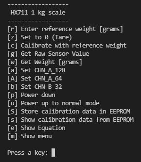

# LoadCell
Shows the use of a loadcell in combination with the HX711 24-bit ADC
### Wiring

```
                               +------------------+ 
 Wiring                 red    o E+   HX711       |
                 Load-  black  o E-           GND o --> GND    Arduino 
                 cell   white  o A-           DT  o --> PIN 3
                        green  o A+           SCK o --> PIN 2
                               o B-           Vcc o --> 5V
                               o B+               |
                               +------------------+
```

## Some Formulas
The following relationship exists between the weight to be measured and the digital 
output value v of the HX711:
```
  weight = m * v + b
```
We therefore only need to determine the two unknowns m and b. We do this by 
determining v0 with 0 load and vref with a reference weight wref, for example 
with the maximum permissible load.

Thus we obtain the two equations: 
```
  0    = m * v0 + b
  wref = m * vref + b
```
Finally we get:
```
  m = wref / (vref - v0)
  b = -wref * v0 / (vref - v0)
  -------------------------------------  
  weight = wref * (v - v0) / (vref - v0)
  ------------------------------------- 
```
## Reading the HX711
 If we consult the data sheet of the HX711, we see that neither I2C nor SPI but 
 a proprietary protocol is used to read out the measured values. The measured 
 value is available as 24-bit value in two's complement. So there are 3 bytes, 
 of which the first read out byte contains the sign.

Two pins are used to read out the 24 bits, PD_SCK as clock input and DOUT as 
data output . As long as DOUT is HIGH, the measurement is not yet finished 
and PD_SCK should be LOW. As soon as DOUT goes LOW, the measured value is 
ready and with 24 positive pulses on PD_SCK the measured value can be read 
from DOUT bit by bit, MSB first. With 1, 2, or 3 additional positive pulses 
of PD_SCK, the readout is completed and at the same time channel and gain 
for the next measurement are set. The typical HIGH and LOW time of the 
PD_SCK pulses is 1 μs and should not be less than 0.2 μs.

So a byte can be read with the following method: 
```
  uint8_t readByte(uint8_t dataPin, uint8_t clockPin, uint8_t bitOrder) 
  {
    uint8_t value = 0;

    for (uint8_t i = 0; i < 8; ++i) 
    {
      digitalWrite(clockPin, HIGH);
      delayMicroseconds(2);  // stretch pulse for safety
      if(bitOrder == LSBFIRST)
        value |= digitalRead(dataPin) << i;
      else
        value |= digitalRead(dataPin) << (7 - i);
      digitalWrite(clockPin, LOW);  
      delayMicroseconds(2);  // stretch pulse for safety
    }
    return value;
  }
```
 We call this method three times and store the result in an array of 3 bytes. 
 We can pack the 3 bytes into an int32_t variable by shifting the first 
 read byte 16 bits to the left, the second byte 8 bits and applying each 
 time a bitwise OR operation. The last byte is only ORed without shifting.

We must take into account that the first byte may be signed. Therefore we 
do a type conversion to int8_t and leave the sign extension in the shift 
operation to the C compiler.

Finally, we need to add the additional pulses depending on the operating 
mode (channel A with gain 128 or 64 or channel B with gain 32). The method 
for reading a raw value from the HX711 now looks like this: 
```
  int32_t getRawValue()
  {
    // HX711 is ready when pinDout goes LOW
    while (digitalRead(_pinDOUT) != LOW) {}

    int32_t value = 0;
    uint8_t bytes[3] = { 0 };

    // read 3 bytes, highest byte first
    for (uint8_t i = 0; i < 3; i++)
        bytes[2 - i] = readByte(_pinDOUT, _pinPD_SCK, MSBFIRST);

    // select channel and the gain for the next reading
    for (uint8_t i = 0; i < (uint8_t)_chn_gain; i++) 
    {
        digitalWrite(_pinPD_SCK, HIGH);
        delayMicroseconds(2);               // stretch pulse for safety
        digitalWrite(_pinPD_SCK, LOW);
        delayMicroseconds(2);               // stretch pulse for safety
    }

    // convert 24-bit 2's complement into 32- bit 2's complement
    value = (int8_t)bytes[2]; // C guarantees the sign extension
    value = value << 16 | (uint32_t)bytes[1] << 8 | (uint32_t)bytes[0]; 
    return value;
  }
```
## User Interface (CLI) and Operation
The user interface is a simple command line interface. The menu items are self-explanatory. 


First we enter the reference weight in grams, then we set the scale to zero 
without any load, then we place the reference weight on the scale and finally 
we calibrate it by pressing key 'c'. When we now press 'w', we see the applied 
weight in grams. 
